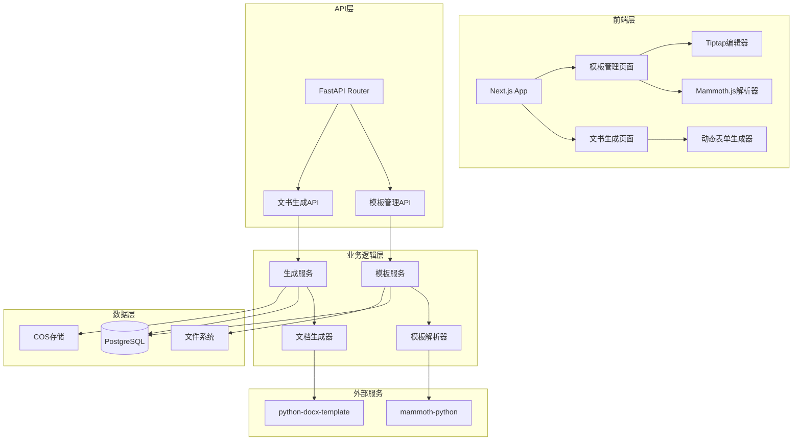

# Design Document

## Overview

本文档描述了文书模板管理与生成系统的技术设计。系统提供完整的模板管理功能，包括模板的创建、编辑、预览、状态管理，以及基于模板的文书生成功能。

系统采用前后端分离架构：

- **后端**：FastAPI + SQLAlchemy 2.0 (异步) + PostgreSQL
- **前端**：Next.js 15 + React 18 + TypeScript + Tiptap + Mammoth.js
- **存储**：PostgreSQL (元数据) + 文件系统 (模板文件) + COS (生成的文档)

## Architecture

### 系统架构图



### 模块划分

#### 后端模块结构

```
app/lex-docx/
├── __init__.py
├── models.py          # 数据模型定义
├── schemas.py         # API数据结构定义
├── routers.py         # API路由定义
├── services.py        # 业务逻辑服务层
└── utils.py           # 工具函数（模板解析、文档生成等）
```

#### 前端模块结构

```
frontend/
├── app/
│   └── lex-docx/
│       ├── page.tsx              # 模板管理主页面
│       ├── generate/
│       │   └── page.tsx          # 文书生成页面
│       └── [id]/
│           └── page.tsx          # 模板详情/编辑页面
├── components/
│   └── lex-docx/
│       ├── TemplateList.tsx     # 模板列表组件
│       ├── TemplateEditor.tsx    # 模板编辑器组件（Tiptap）
│       ├── TemplatePreview.tsx   # 模板预览组件
│       ├── PlaceholderConfig.tsx # 占位符配置组件
│       ├── DynamicForm.tsx       # 动态表单生成组件
│       └── GenerateHistory.tsx   # 生成记录组件
└── lib/
    └── api/
        └── lex-docx.ts  # API客户端
```

## Components and Interfaces

### 后端组件

#### 1. 数据模型 (models.py)

**DocumentTemplate 模型**

- `id`: 主键
- `name`: 模板名称
- `description`: 模板描述（可选）
- `category`: 分类名称（可选）
- `status`: 状态（draft/published）
- `content`: 模板内容（DOCX格式，存储为二进制或文件路径）
- `content_html`: 模板HTML内容（用于前端预览和编辑）
- `placeholder_metadata`: 占位符元数据（JSONB格式）
- `created_by`: 创建人ID（外键关联Staff）
- `updated_by`: 更新人ID（外键关联Staff）
- `created_at`: 创建时间
- `updated_at`: 更新时间

**DocumentGeneration 模型**

- `id`: 主键
- `template_id`: 模板ID（外键）
- `generated_by`: 生成人ID（外键关联Staff）
- `form_data`: 表单数据（JSONB格式）
- `document_url`: 生成的文档COS URL
- `document_filename`: 文档文件名
- `generated_at`: 生成时间

**占位符元数据结构 (placeholder_metadata)**

```json
{
  "field_name": {
    "type": "text|number|date|textarea|checkbox|multiselect",
    "label": "字段显示标签",
    "required": true|false,
    "default_value": "默认值",
    "options": ["选项1", "选项2"],  // 仅多选框需要
    "validation": {
      "min": 0,  // 数字类型
      "max": 100,
      "pattern": "正则表达式"  // 文本类型
    }
  }
}
```

#### 2. API接口 (routers.py)

**模板管理API**

- `GET /api/v1/lex-docx` - 获取模板列表（支持搜索、筛选、分页）
- `GET /api/v1/lex-docx/{id}` - 获取模板详情
- `POST /api/v1/lex-docx` - 创建模板
- `PUT /api/v1/lex-docx/{id}` - 更新模板
- `DELETE /api/v1/lex-docx/{id}` - 删除模板
- `PUT /api/v1/lex-docx/{id}/status` - 更新模板状态（草稿/已发布）
- `GET /api/v1/lex-docx/{id}/preview` - 获取模板预览HTML
- `POST /api/v1/lex-docx/import` - 导入模板（上传DOCX文件）
- `GET /api/v1/lex-docx/{id}/export` - 导出模板（下载DOCX文件）

**文书生成API**

- `GET /api/v1/lex-docx/published` - 获取已发布模板列表（用于生成页面）
- `POST /api/v1/lex-docx/generations` - 生成文书
- `GET /api/v1/lex-docx/generations` - 获取生成记录列表（支持筛选、分页）
- `GET /api/v1/lex-docx/generations/{id}` - 获取生成记录详情
- `GET /api/v1/lex-docx/generations/{id}/download` - 下载生成的文档

**注意**：为了避免与现有的 `document-templates` 路由冲突，所有 API 端点使用 `/api/v1/lex-docx` 作为前缀。

#### 3. 服务层 (services.py)

**TemplateService**

- `create_template()`: 创建模板
- `update_template()`: 更新模板
- `get_template_by_id()`: 获取模板详情
- `list_templates()`: 获取模板列表（支持筛选、搜索、分页）
- `update_template_status()`: 更新模板状态
- `delete_template()`: 删除模板
- `import_template()`: 导入模板（从DOCX文件）
- `export_template()`: 导出模板（生成DOCX文件）
- `parse_placeholders()`: 解析模板中的占位符
- `convert_docx_to_html()`: 将DOCX转换为HTML（用于编辑和预览）
- `convert_html_to_docx()`: 将HTML转换回DOCX（保存时）

**GenerationService**

- `generate_document()`: 生成文书
- `list_generations()`: 获取生成记录列表
- `get_generation_by_id()`: 获取生成记录详情
- `download_document()`: 下载生成的文档

#### 4. 工具函数 (utils.py)

**TemplateParser**

- `extract_placeholders()`: 从模板内容中提取占位符
- `validate_placeholder_name()`: 验证占位符名称合法性
- `build_placeholder_metadata()`: 构建占位符元数据

**DocumentConverter**

- `docx_to_html()`: DOCX转HTML（使用mammoth-python）
- `html_to_docx()`: HTML转DOCX（使用python-docx）

**DocumentGenerator**

- `render_template()`: 使用python-docx-template渲染模板
- `upload_to_cos()`: 上传生成的文档到COS

### 前端组件

#### 1. 模板管理页面组件

**TemplateList**

- 左侧边栏显示模板列表
- 支持搜索和筛选
- 显示模板状态标识
- 点击模板切换预览

**TemplateEditor**

- 基于Tiptap的富文本编辑器
- 支持文本格式设置
- 占位符插入和管理
- 实时保存功能

**TemplatePreview**

- 渲染模板HTML内容
- 高亮显示占位符
- 保持原始格式样式

**PlaceholderConfig**

- 占位符元数据配置表单
- 支持字段类型选择
- 配置字段属性（标签、必填、默认值等）

#### 2. 文书生成页面组件

**TemplateSelector**

- 显示已发布模板列表
- 支持分类筛选
- 模板预览功能

**DynamicForm**

- 根据占位符元数据动态生成表单
- 支持多种字段类型（文本、数字、日期、多行文本、复选框、多选框）
- 实时表单验证
- 草稿保存功能

**GenerateHistory**

- 显示生成记录列表
- 支持筛选和分页
- 文档下载功能

## Data Models

### 数据库表结构

#### document_templates 表

| 字段名               | 类型         | 约束                      | 说明                  |
| -------------------- | ------------ | ------------------------- | --------------------- |
| id                   | INTEGER      | PRIMARY KEY               | 主键                  |
| name                 | VARCHAR(200) | NOT NULL                  | 模板名称              |
| description          | TEXT         | NULL                      | 模板描述              |
| category             | VARCHAR(100) | NULL                      | 分类名称              |
| status               | VARCHAR(20)  | NOT NULL, DEFAULT 'draft' | 状态：draft/published |
| content_path         | VARCHAR(500) | NULL                      | 模板DOCX文件路径      |
| content_html         | TEXT         | NULL                      | 模板HTML内容          |
| placeholder_metadata | JSONB        | NULL                      | 占位符元数据          |
| created_by           | INTEGER      | NULL, FK(staffs.id)       | 创建人ID              |
| updated_by           | INTEGER      | NULL, FK(staffs.id)       | 更新人ID              |
| created_at           | TIMESTAMP    | NOT NULL, DEFAULT now()   | 创建时间              |
| updated_at           | TIMESTAMP    | NOT NULL, DEFAULT now()   | 更新时间              |

**索引**：

- `idx_document_templates_status`: (status)
- `idx_document_templates_category`: (category)
- `idx_document_templates_name`: (name)

#### document_generations 表

| 字段名            | 类型         | 约束                                | 说明        |
| ----------------- | ------------ | ----------------------------------- | ----------- |
| id                | INTEGER      | PRIMARY KEY                         | 主键        |
| template_id       | INTEGER      | NOT NULL, FK(document_templates.id) | 模板ID      |
| generated_by      | INTEGER      | NOT NULL, FK(staffs.id)             | 生成人ID    |
| form_data         | JSONB        | NOT NULL                            | 表单数据    |
| document_url      | VARCHAR(500) | NOT NULL                            | 文档COS URL |
| document_filename | VARCHAR(200) | NOT NULL                            | 文档文件名  |
| generated_at      | TIMESTAMP    | NOT NULL, DEFAULT now()             | 生成时间    |

**索引**：

- `idx_document_generations_template_id`: (template_id)
- `idx_document_generations_generated_by`: (generated_by)
- `idx_document_generations_generated_at`: (generated_at)

### 数据流

#### 模板创建流程

1. 用户在前端创建模板，输入基本信息
2. 用户使用Tiptap编辑器编辑模板内容
3. 用户插入占位符并配置元数据
4. 前端将HTML内容发送到后端
5. 后端将HTML转换为DOCX格式保存到文件系统
6. 后端解析占位符并保存元数据到数据库
7. 模板保存为草稿状态

#### 模板发布流程

1. 用户编辑完成模板
2. 用户点击"发布"按钮
3. 后端验证模板至少包含一个占位符
4. 后端更新模板状态为"已发布"
5. 模板可用于文书生成

#### 文书生成流程

1. 用户选择已发布的模板
2. 后端返回模板信息和占位符元数据
3. 前端根据元数据动态生成表单
4. 用户填写表单数据
5. 前端验证表单数据
6. 用户点击"生成"按钮
7. 后端使用python-docx-template渲染模板
8. 后端将生成的文档上传到COS
9. 后端保存生成记录到数据库
10. 返回文档下载链接

## Error Handling

### 后端错误处理

**统一错误响应格式**

```json
{
  "code": 400,
  "message": "错误描述",
  "detail": "详细错误信息（可选）"
}
```

**错误类型**

1. **验证错误 (400)**

   - 模板名称不能为空
   - 占位符名称格式不正确
   - 模板状态切换验证失败
   - 表单数据验证失败
2. **权限错误 (403)**

   - 非超级管理员尝试切换模板状态
   - 无权限访问模板
3. **资源不存在 (404)**

   - 模板不存在
   - 生成记录不存在
4. **业务逻辑错误 (422)**

   - 模板发布时没有占位符
   - 文档生成失败
5. **服务器错误 (500)**

   - 文件上传失败
   - 文档转换失败
   - 数据库操作失败

### 前端错误处理

1. **API调用错误**

   - 使用统一的错误处理中间件
   - 显示用户友好的错误提示
   - 记录错误日志
2. **表单验证错误**

   - 实时验证输入
   - 显示字段级别的错误信息
   - 阻止无效提交
3. **文件操作错误**

   - 文件上传失败提示
   - 文件格式验证
   - 文件大小限制

## Testing Strategy

### 后端测试

#### 单元测试

1. **模型测试**

   - 模板创建和更新
   - 占位符元数据验证
   - 状态转换逻辑
2. **服务层测试**

   - TemplateService方法测试
   - GenerationService方法测试
   - 模板解析和转换测试
3. **工具函数测试**

   - 占位符提取和验证
   - DOCX和HTML转换
   - 文档生成逻辑

#### 集成测试

1. **API端点测试**

   - 模板CRUD操作
   - 模板状态切换
   - 文书生成流程
   - 文件上传和下载
2. **数据库测试**

   - 数据持久化
   - 关联查询
   - 事务处理

### 前端测试

#### 组件测试

1. **模板编辑器测试**

   - Tiptap编辑器功能
   - 占位符插入和配置
   - 内容保存和加载
2. **动态表单测试**

   - 表单字段生成
   - 表单验证
   - 数据提交
3. **模板预览测试**

   - HTML渲染
   - 占位符高亮
   - 格式保持

#### E2E测试

1. **模板管理流程**

   - 创建模板
   - 编辑模板
   - 发布模板
2. **文书生成流程**

   - 选择模板
   - 填写表单
   - 生成文档
   - 下载文档

### 测试数据

1. **测试模板**

   - 包含各种占位符类型的模板
   - 复杂格式的模板（表格、列表等）
2. **测试用例**

   - 正常流程测试
   - 边界条件测试
   - 异常情况测试

## 技术选型说明

### 后端技术

1. **python-docx-template**

   - 用于基于模板生成DOCX文档
   - 支持Jinja2语法（{{variable}}）
   - 支持复杂结构（表格、循环等）
2. **mammoth-python**

   - 用于将DOCX转换为HTML
   - 保持文档格式
   - 支持样式转换
3. **文件系统存储**

   - 模板DOCX文件存储在本地文件系统
   - 路径：`templates/document-templates/{template_id}.docx`

### 前端技术

1. **Tiptap**

   - 基于ProseMirror的富文本编辑器
   - 支持扩展和自定义
   - 良好的性能和用户体验
2. **Mammoth.js**

   - 将DOCX转换为HTML（用于预览）
   - 浏览器端处理，无需后端转换
3. **React Hook Form**

   - 动态表单管理
   - 表单验证
   - 性能优化

## 安全考虑

1. **权限控制**

   - 模板状态切换仅超级管理员可操作
   - 模板编辑权限验证
   - 生成记录访问权限
2. **文件安全**

   - 文件类型验证
   - 文件大小限制
   - 文件名清理（防止路径遍历）
3. **数据验证**

   - 占位符名称验证（防止注入）
   - 表单数据验证
   - SQL注入防护（使用ORM）
4. **COS访问控制**

   - 生成文档使用私有访问
   - 提供临时下载链接
   - 访问权限验证

## 性能优化

1. **模板列表**

   - 分页加载
   - 按需加载模板内容
   - 缓存模板元数据
2. **文档生成**

   - 异步处理（可选，使用Celery）
   - 文档缓存（相同数据不重复生成）
   - COS CDN加速
3. **前端优化**

   - 懒加载组件
   - 虚拟滚动（长列表）
   - 防抖和节流

## 扩展性考虑

1. **模板版本管理**（未来）

   - 添加版本表
   - 支持版本回滚
2. **批量生成**（未来）

   - 支持批量数据导入
   - 异步任务处理
3. **案件关联**（未来）

   - 添加case_id字段
   - 从案件数据自动填充表单
4. **模板协作**（未来）

   - 多用户编辑
   - 编辑冲突处理
