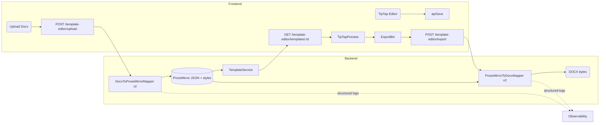

# Design Document

## Overview

本设计围绕“docx-template-consistency”特性，目标是在 docx ↔︎ ProseMirror 转换链路和前端渲染中保留字体、颜色、段落样式、列表结构、表格列宽等格式信息，消除因格式丢失导致的预览/导出不一致问题。设计包含后端解析与导出映射器增强、统一样式 schema、前端动态渲染、日志与降级策略，确保复杂模板能稳定上传、编辑、预览、导出。

## Architecture



关键改动：
- Docx 解析器升级：扩展 run/paragraph/table/list/shading/spacing 属性映射，颜色转换修复。
- ProseMirror schema 统一：属性命名与前端 TipTap 渲染一致，通过 `textStyle`, `paragraphStyle`, `tableMeta` 等存储。
- 前端 DocumentEditor / DocumentPreview 读取 JSON 属性动态构建 class/style，而非强制 Tailwind 预设。
- 导出映射器对 JSON 样式逐段逐 run 写入 Word，同时保留原始 tblGrid 列宽。
- 统一日志：解析/导出出现降级时记录 element path + reason，便于排查。

## Components and Interfaces

### Backend
- `DocxToProseMirrorMapper`
  - 新增 `ListMapper`：检测 `para.style.list_level`, `numPr` 等生成 ordered/unordered list 节点。
  - `rgb_to_hex` 修复：使用 `run.font.color.rgb` 字符串或 `run.font.color.theme_color`，转换失败记录 warn。
  - Paragraph attrs：`textAlign`, `indent`, `firstLineIndent`, `spacing`, `styleName`, `listType`, `listLevel`, `tabStops`.
  - Run marks：保留 `bold, italic, underline, strike`，新增 `color`, `backgroundColor`, `fontFamily`, `fontSize`, `smallCaps`, `allCaps`.
  - Table attrs：`colWidths`, `cellWidth`, `borderStyle`, `shading`, `verticalAlign`, `wrapText`, `cellPadding`。
  - 捕获异常：元素级 try/except，写入 `logger.warning` 并标记 `attrs["__fallback"]=true`。

- `ProseMirrorToDocxMapper`
  - 依据 JSON 属性设置 `ParagraphFormat`、`Font`、`numPr`、`listStyle`.
  - 生成表格前应用 `tblLayout=Fixed`，根据 `colWidths` 填写 `tblGrid`、`tcW`，支持 `backgroundColor`.
  - 仅在 JSON 未指定字体时 fallback `Normal` 样式，避免覆盖。
  - 导出时对未知属性记录 warn 并忽略。

- API 层
  - 上传接口验证 JSON schema，异常返回 400 并包含 `detail`, `elementPath`.
  - 导出接口增加 `?debug=true` 返回日志片段协助排查。

### Frontend
- `DocumentEditor`
  - TipTap 扩展：`TextStyle`, `Color`, `ListItem`, `OrderedList`, `BulletList`, `Heading`, `Table`, 自定义 `ParagraphAttrs` 扩展以支持 `textAlign`, `lineHeight`, `indent`.
  - 取消硬编码 `font-family`/表格 class，改用 `style` 计算函数（根据节点 attrs 注入 inline style）。
  - 表格渲染：使用 `colgroup` 控制列宽，CSS 根据 `colWidths` 动态生成。
  - 提供样式面板：允许编辑字体、字号、颜色、行距、缩进、列表层级。

- `DocumentPreview`
  - 复用 editor 的 extensions，但 `editable=false`。
  - 引入只读 `StyleRenderer`：解析 JSON attrs 输出 inline style，确保预览与导出一致。

- `placeholder-list.tsx` (若需要)：按照新的 JSON 结构解析。

## Data Models

- `DocumentTemplate.prosemirror_json`：存储完整节点属性，需通过 migration 确保 JSON 不被裁剪。
- `TemplatePlaceholder` 无需调整，但新增的样式属性不再影响 placeholder 抽取。
- 新增 `DocxMappingLog`（可选）：`template_id`, `stage( parse/export )`, `element_path`, `level`, `message`, `meta JSON`，用于持久化调试信息（若不落库，可先通过 log file）。

Schema 约定：
```json
{
  "type": "paragraph",
  "attrs": {
    "textAlign": "center",
    "fontFamily": "SimSun",
    "fontSize": "14pt",
    "spacing": {"before": 12, "after": 8},
    "list": {"type": "ordered", "level": 2, "marker": "1."},
    "indent": 20
  },
  "content": [...]
}
```

## Error Handling

- 解析阶段：
  - `rgb_to_hex` 捕获 `AttributeError`, `ValueError`，返回 `None` 并记录 `logger.warning("color fallback", element_path=...)`.
  - 列表/表格解析异常：添加 `attrs["__fallback"]=true`，以便前端/导出识别。
  - 上传接口统一抛出 `ValueError`，FastAPI 转换为 `HTTPException(status_code=400, detail=...)`。

- 导出阶段：
  - 对未知样式属性使用默认值并记日志。
  - 若 `colWidths` 长度不匹配 `max_cols`，写警告并计算平均列宽。
  - 生成 DOCX 前全局 try/except，错误信息包含模板 ID、元素索引。

- 前端：
  - 渲染失败时显示 toast “部分样式已降级”，控制台输出节点 path。
  - 上传/导出 API 调用捕获 400/500，根据 `detail.element_path` 在 UI 提示。

## Testing Strategy

1. **Unit Tests (Python)**
   - `test_mapping_colors.py`: 覆盖 `rgb_to_hex`、`hex_to_rgb` 正常/异常输入。
   - `test_docx_to_pm_lists.py`: 构造含编号/项目符号 docx，断言 JSON 中 `list` attrs。
   - `test_tables_with_colwidth.py`: 验证解析与导出结果的 `colWidths`、`tcW` 保持一致。
   - `test_roundtrip_styles.py`: 解析→导出→再解析，确保字体/对齐等属性一致。

2. **Integration Tests (FastAPI)**
   - `/template-editor/upload` 上传多种样式 docx，断言响应 JSON 无错误，且日志中不含 ERROR。
   - `/template-editor/export` 对已保存模板导出，检查生成的 docx 使用 `python-docx` 解析后与 JSON 匹配。

3. **Frontend Tests**
   - Jest/RTL：渲染 `DocumentPreview`/`DocumentEditor`，传入带样式 JSON，断言 DOM style。
   - E2E（Playwright）：上传复杂 docx，预览、编辑、导出，再次上传导出文件，比较关键信息。

4. **Manual Regression**
   - 覆盖简单/复杂模板（含中文字体、跨页表格、嵌套列表）。
   - 验证降级提示与日志输出。


