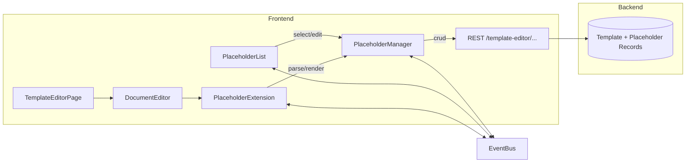

# Design Document

## Overview

本设计扩展模板编辑器（TipTap）在“编辑模式”下的占位符能力，使文档正文中的 `{{placeholder}}` 文本与左侧占位符列表实现双向映射、交互高亮、弹窗编辑及增删同步；同时保证底层 ProseMirror JSON 仍以纯文本形式存储占位符，导出链路不受影响。方案核心是新增 Placeholder 管理上下文、TipTap 扩展节点视图以及联动事件总线，确保 UI 交互与后端持久化保持一致。

## Architecture



关键流转：
1. 进入编辑模式后，PlaceholderManager 根据当前 ProseMirror JSON 与后端占位符元数据生成标准化占位符字典。
2. TipTap PlaceholderExtension 在 `onCreate`/`onUpdate` 中扫描 `{{ }}` 文本并替换成自定义 NodeView（含 data-id），通过 EventBus 与列表同步高亮。
3. 列表/文档点击触发 PlaceholderManager 打开弹窗；保存后调用 TemplateAPI 写入并回填 JSON，保持导出仍看到 `{{name}}`。
4. 新增/删除操作由 PlaceholderManager 协调：更新后端 → 更新 JSON → 触发编辑器/列表刷新。

## Components and Interfaces

### PlaceholderManager（新）
- 负责占位符解析、唯一 ID 分配（如 `ph-${index}`）、状态管理（绑定、未绑定、脏状态）。
- 提供 React Context，向 `document-editor.tsx`、`placeholder-list.tsx`、`document-preview.tsx` 暴露：
  - `placeholders: Record<string, PlaceholderMeta>`
  - `selectPlaceholder(id)`、`highlight(id)`、`openEditor(id)`
  - `createPlaceholder(payload, position)`、`updatePlaceholder(id, payload)`、`removePlaceholder(id)`
  - 事件订阅 API（或直接使用 context state）
- 与现有模板 API 交互：
  - `GET /template-editor/templates/:id/placeholders`
  - `POST/PUT/DELETE /template-editor/placeholders`
  - 所有操作完成后触发 `onSync(success)`，失败时回滚 UI。

### PlaceholderExtension（TipTap 扩展）
- 基于 `TextStyle` 或自定义 `InlineNode` 实现：
  - 在 `parseHTML`/`renderHTML` 维持 `{{name}}` 文本。
  - `NodeView` 渲染 `<span data-placeholder-id="..." class="ph-chip">{{name}}</span>`，添加 hover/click 事件。
  - `InputRule`、`PasteRule` 解析 `{{...}}` 输入自动创建节点并阻止拆分。
  - Selection decoration：选中时添加 `ph-chip--active` class。
- 与 PlaceholderManager 通信：
  - NodeView click → `PlaceholderManager.openEditor(id)`。
  - `PlaceholderManager.highlight(id)` → 通过 ProseMirror DecorationSet 设置高亮。
- 保证 `toJSON` 仍输出纯文本：在 `attrs` 中仅存 `placeholderId`，`text` 字段保持 `{{name}}`。

### PlaceholderList（左侧面板）
- 数据来源改为 `PlaceholderManager.placeholders`。
- 行交互：hover → `highlight(id)`；click/edit → `openEditor(id)`；delete → `removePlaceholder(id)`。
- 新增按钮：`createPlaceholder`，需要提供插入位置策略（默认使用编辑器当前 selection，由 DocumentEditor 暴露 `getSelectionPos`）。
- 对“未绑定”占位符展示 warning tag。

### PlaceholderModal（复用或新建）
- 表单字段：名称（显示名）、fieldKey（`plaintiff_name`）、描述、默认值、数据类型。
- 校验：fieldKey 必须唯一、遵守后端命名规则。
- 支持两种模式：编辑已有（回填数据）、新增（插入位置 + 元数据）。
- 保存流程：调用 PlaceholderManager 的 CRUD，展示 Loading/成功/失败反馈。

### DocumentEditor 集成
- 初始化时注入 PlaceholderExtension，传入 `onPlaceholderAction` hook。
- 提供 `insertPlaceholder({fieldKey, displayName})` 方法用于新增。
- 在 `onUpdate` 中，调用 PlaceholderManager `syncFromDoc(editorJSON)` 以侦测手动输入 `{{ }}` 的新占位符。
- 维护 `selectionMap`，供 PlaceholderManager 知道当前光标以便插入。

### EventBus / Context 实现
- 可使用 React Context + Zustand 或 `use-event-emitter`：
  - 事件：`placeholder:select`, `placeholder:hover`, `placeholder:update`, `placeholder:delete`。
  - 确保不同组件松耦合。

## Data Models

```ts
type PlaceholderMeta = {
  id: string         // 本地唯一 ID
  fieldKey: string   // 如 plaintiff_name
  label: string      // 左侧展示名
  description?: string
  defaultValue?: string
  status: "bound" | "unbound" | "error"
  position: {
    nodeId: string
    from: number
    to: number
  }
  dirty?: boolean    // 本地未持久化
}
```

- PlaceholderManager 维护字典 + ordered 数组，便于列表排序。
- ProseMirror 节点 attrs：`{ placeholderId, fieldKey }`，但 `text` 始终是 `{{fieldKey}}`。
- 后端 API 接口扩展（若已有可复用）：要求新增/更新相同字段，导出 JSON 不添加额外装饰。

## Error Handling

- CRUD 请求失败：
  - PlaceholderManager 捕获异常 → revert 本地状态 → toast 错误信息。
  - 对于删除失败（例如后端引用），将 PlaceholderMeta 标记 `status: "error"` 并恢复节点。
- 解析失败：如果 TipTap 无法构建 PlaceholderNode，则退回为普通文本但在列表中标记“未解析”。
- 交互异常（例如 NodeView 没有 ID）：在控制台输出 warning，防止页面崩溃。
- EventBus 监听未绑定 ID 时忽略并写日志。

## Testing Strategy

1. **Unit Tests (Frontend Jest + Testing Library)**
   - PlaceholderManager：解析 JSON、CRUD、冲突检测、回滚逻辑。
   - PlaceholderExtension：InputRule 将 `{{foo}}` 转为节点、NodeView 事件分发。
   - PlaceholderList：hover/click 触发 highlight/select。

2. **Integration Tests (React Testing Library / Playwright)**
   - 渲染 DocumentEditor + PlaceholderList，模拟点击列表使文档高亮；反向点击文档打开 modal。
   - 新增占位符流程：输入信息 → 插入文档 → 列表出现 → onChange JSON 仍含 `{{name}}`。
   - 删除流程：从文档删除 → 列表消失 → 导出调用（mock）仍看到 `{{name}}`。

3. **Regression Checks**
   - 切换预览模式（非编辑）时 PlaceholderExtension 应降级为普通文本，不出现交互包装。
   - 导出（调用现有 API, mock JSON）验证输出字符串未包含多余 HTML class。

此设计覆盖需求 1-4，确保交互增强与导出保持解耦，便于后续实现。
