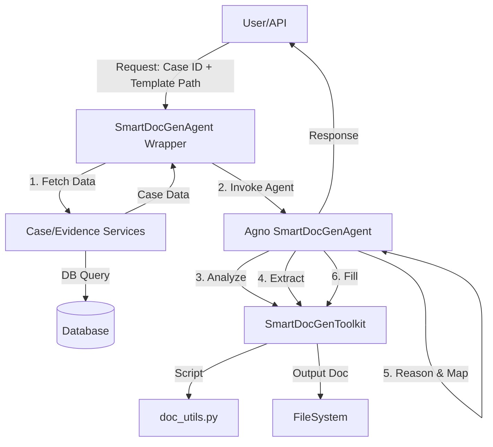

# Design: Smart Document Generation Agent

## Architecture

### Components
1.  **SmartDocGenToolkit**: An Agno `Toolkit` (inheriting from `agno.tools.Toolkit`) that exposes the document processing capabilities.
    -   `analyze_template(template_path: str) -> str`: Analyzes the template structure.
    -   `extract_structure(template_path: str) -> str`: Extracts placeholders.
    -   `fill_template(template_path: str, output_path: str, fillings: str) -> str`: Generates the document.
2.  **SmartDocGenAgent**: An Agno `Agent` (inheriting from `agno.agent.Agent`) configured with:
    -   **Tools**: `[SmartDocGenToolkit()]`.
    -   **Context**: Can optionally use `storage` to persist session state if multi-turn interaction is needed.
    -   **Instructions**: System prompt defining the 4-step workflow.

### Data Flow

## Skill to Agent Transformation
This section describes how the original Claude Skill is mapped to the Agno Agent architecture.

| Feature | Claude Skill (`.claude/skills/smart-doc-gen`) | Agno Agent (`app/agentic`) |
| :--- | :--- | :--- |
| **Runtime** | Client-side (IDE/CLI) via `openskills` | Server-side (Python/FastAPI) via `agno` |
| **Input** | Static JSON file (`case.json`) | Dynamic DB Data (`case_id` -> `CaseModel`) |
| **Data Access** | File System Read | `app.cases.services` & `app.evidences.services` |
| **Logic** | Prompt-based logic in `SKILL.md` + Scripts | Python Class `SmartDocGenAgent` + Instructions |
| **Tools** | `bash` calls to `docx_utils.py` | `SmartDocGenToolkit` (`agno.tools.Toolkit`) |

### Design Decisions
1.  **Service Integration**: The Agent will accept a `case_id`. A wrapper service (or the endpoint handler) will fetch the full Case and Evidence graph using `app.cases.services.get_by_id`, serialize it to a context string, and pass it to the Agent's run method.
2.  **Toolkit Pattern**: We will implement `SmartDocGenToolkit` by subclassing `agno.tools.Toolkit`. This allows us to use Agno's `register` decorator to easily expose methods as tools with proper type hints and descriptions, which Agno automatically converts to tool schemas for the LLM.
3.  **State Management**: Initial implementation will be stateless (per request), but by using `agno.agent.Agent`, we can easily enable `storage` (e.g., `SqlAgentStorage`) later if we want to allow users to refine the document through conversation.
